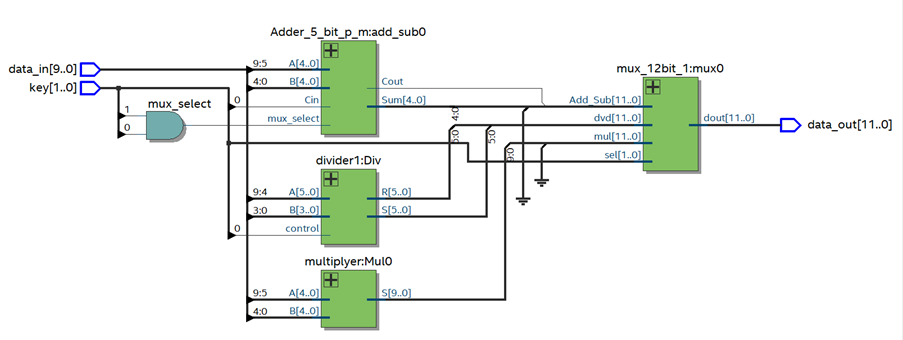

# Verilog FPGA Calculator

This is a Verilog based calculator designed to perform four basic arithmetic operations: addition, subtraction, multiplication, and division. The calculator does not rely on the standard arithmetic operators of +, -, *, and / to perform these operations. Rather, these operators are realized only by logic gates that make up the building blocks for the realization.

### Specifications
In the implementation of the calculator, a DE10-Lite board was used. The calculator returns the calculated solution in unsigned hexadecimal digits. The design of the units is modular, allowing for easy modification of individual units and the addition of new functions or extensions to the calculator.

The results of the arithmetic operations are calculated in parallel, requiring only one clock cycle for the transition between states by T-FF. The board buttons are used to select the desired arithmetic operation (KEY[1:0]) and to enter binary numbers A and B for the operation (SW[9:0]).

Addition and multiplication are performed using A=SW[9:5] and B=SW[4:0].
Subtraction is performed using A=SW[9:5] and B=SW[4:0]. An error message will be displayed if B>A.
Division is performed using A=SW[9:4] and B=SW[3:0]. The result will be displayed as an integer and a remainder with a dot displayed between them. An error message will be displayed if B=0.

### Usage
To select an operation, press the KEY button to cycle through the available options. The selection will be displayed on LEDR0 and LEDR1. Choose as follows: addition - 00, subtraction - 01, multiplication - 10, division - 11. The binary numbers A and B can be inserted using the SW button.
